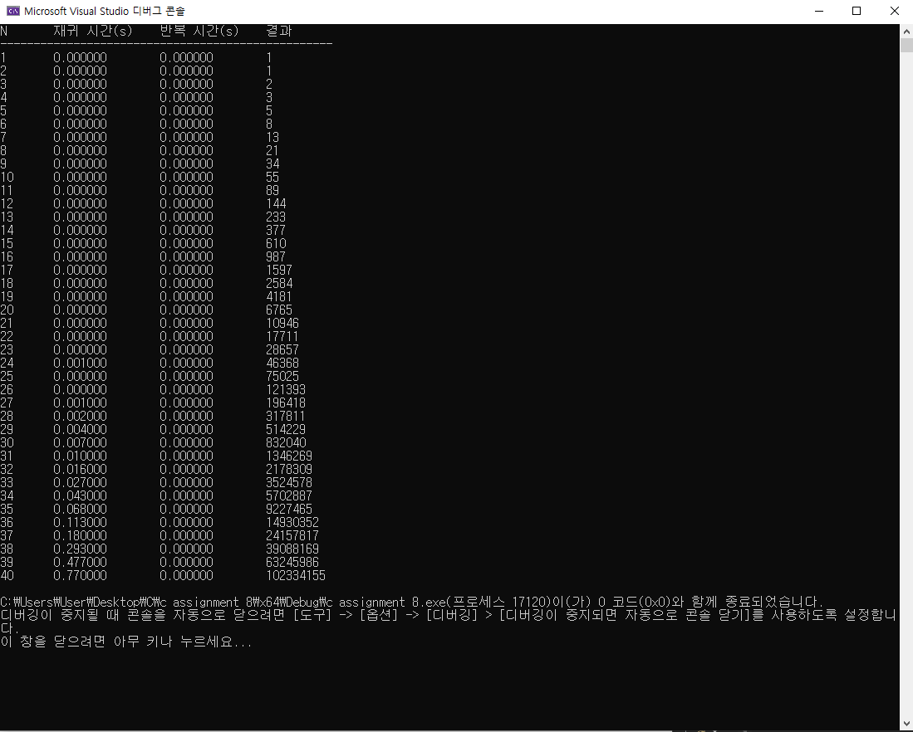
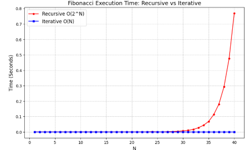

# 피보나치 수열 알고리즘 성능 분석 (순환 vs 재귀)

## 1. 개요
피보나치 수열을 두 가지 방식(순환적 방법, 재귀적 방법)으로 C언어를 통해 구현하고, 
정수 N의 크기가 증가함에 따라 각 방식의 수행 시간이 어떻게 변화하는지 비교,분석하는 것을 목적으로 한다. 

## 2. 구현 방법 
* **순환적 방법 (Iterative):**

  * **코드:**
    ```c
    long long fibo_i(int n) { 
        if (n <= 2) return 1; 
        long long a = 1, b = 1, c = 0; 
        for (int i = 3; i <= n; i++) { 
            c = a + b; 
            a = b; 
            b = c; 
        } 
        return c; 
    }
    ```
    
  * **설명:** F(1)=1, F(2)=1부터 시작해서 앞의 두 수를 더해 다음 수를 구하는 걸 N번 반복한다.
  * 변수 두 개만 바꿔가며 계산하므로 메모리를 거의 안 쓴다.

---

* **재귀적 방법 (Recursive):**

  * **코드:**
    ```c
    long long fibo_r(int n) { 
        if (n <= 2) return 1; 
        return fibo_r(n - 1) + fibo_r(n - 2); 
    }
    ```

  * **설명:** F(N) = F(N-1) + F(N-2)를 함수가 자기 자신을 호출하며 계산한다.
    F(5)를 구하려면 F(4), F(3)을 호출하고, F(4)는 또 F(3), F(2)를 호출하는 식으로 트리 형태로 호출이 퍼진다.
    
### 3. 시간 복잡도 분석

* **순환적 방법: $O(N)$**
  순환 방식은 N번의 루프만 돈다. 예를 들어 N이 10이면 10번, N이 100이면 100번만 계산하므로 N의 크기에 비례하여 선형적으로 늘어난다.
  

* **재귀적 방법: $O(2^N)$**
  재귀 방식은  F(N)을 구하려면 F(N-1)과 F(N-2)를 각각 새로 계산한다. 한 번 계산했던 값을 기억하지 목하고 같은 값을 중복해서 계산하기 때문이다.
  
  **[ F(5) 호출 시 중복 계산 발생 예시 ]**
  ```text
  F(5)
  ├── F(4)
  │   ├── F(3)
  │   │   ├── F(2)
  │   │   └── F(1)
  │   └── F(2)       <-- F(2) 중복 계산
  └── F(3)           <-- F(3) 최상단에서부터 중복 계산
      ├── F(2)       <-- F(2) 중복
      └── F(1)


### 4. 프로파일링 결과
* **표**


* **그래프**


### 5. 비교 분석

| 항목 | 순환 (Iterative) | 재귀 (Recursive) |
| :--- | :--- | :--- |
| **시간 복잡도** | **$O(N)$** (선형 시간) | **$O(2^N)$** (지수 시간) |
| **공간 복잡도** | **$O(1)$**  | **$O(N)$** 
재귀는 함수 호출마다 콜스택에 쌓이기 때문에, 깊이가 N에 비례해 메모리를 O(N)만큼 사용한다. |
| **코드 가독성** | 루프 구조로 조금 더 길어짐 | 수학적 정의와 일치, 직관적 |
| **주요 특징** | 중복 계산이 없어 효율적임 | 동일한 하위 문제의 중복 호출 발생 |
| **실용성** | N이 커도 즉시 계산 가능 | N이 40 이상이면 사실상 사용 불가 |

### 6. 결론

두 방법 모두 피보나치를 올바르게 계산한다.
재귀는 코드를 직관적이고 수학적 수식과 가깝게 작성할 수 있다는 장점이 있지만, N이 커지면 기하급수적으로 느려진다는 단점이 있다.
순환은 성능이 훨씬 좋고 실용적이다. 따라서 연산 횟수를 고려하여 반복문을 쓴 순환을 사용하는 것이 올바르다.  

  


    
